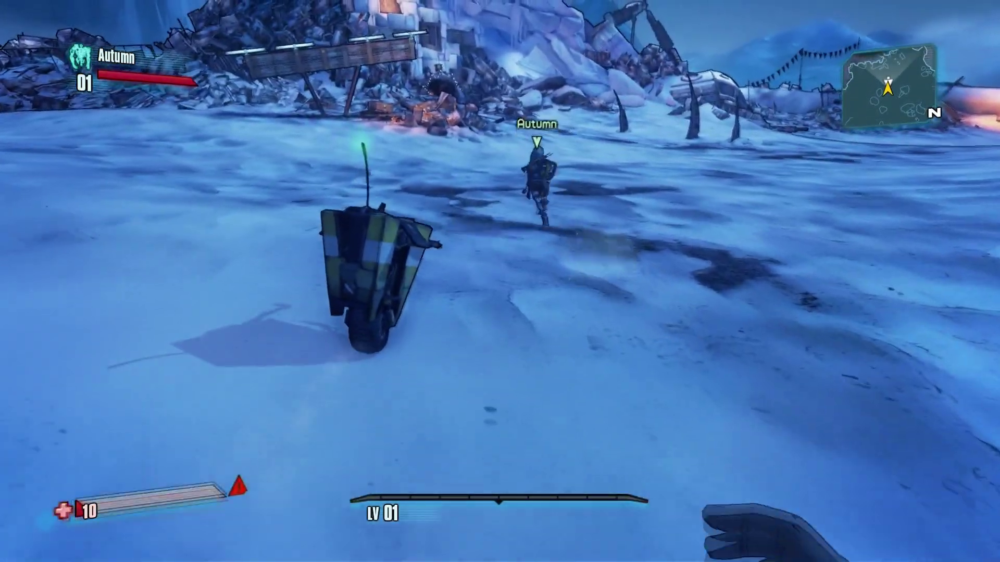
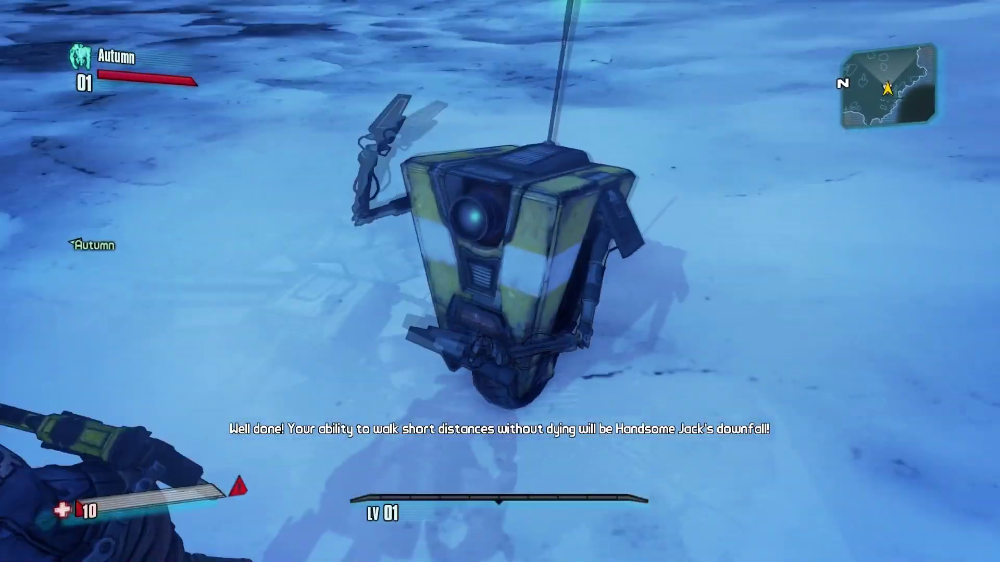
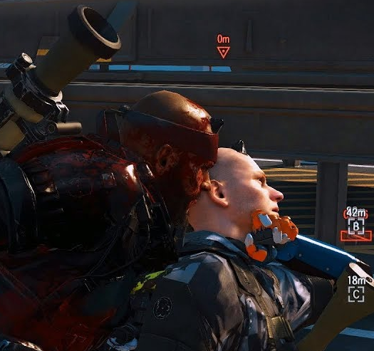
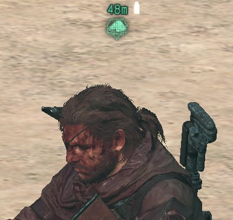
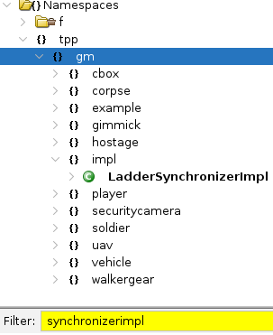

Making of dynamite
====

<!-- TOC -->
* [Making of dynamite](#making-of-dynamite)
    * [Fuse](#fuse)
    * [Co-op?](#co-op)
    * [Ghidra](#ghidra)
    * [Connecting players](#connecting-players)
    * [Problems](#problems)
      * [Damage](#damage)
      * [Revenge system](#revenge-system)
      * [Hostage flags](#hostage-flags)
    * [AI again](#ai-again)
    * [Connection filtering](#connection-filtering)
    * [Testing](#testing)
      * [Markers](#markers)
      * [User/enemy markers](#userenemy-markers)
      * [Markers over network](#markers-over-network)
      * [Vehicles](#vehicles)
      * [Buddies](#buddies)
      * [Helicopter](#helicopter)
      * [Supply drop](#supply-drop)
      * [Weather modification / pills / cigar](#weather-modification--pills--cigar)
      * [Interrogations](#interrogations)
      * [Gimmicks / physics](#gimmicks--physics)
      * [Free roam](#free-roam)
      * [16 player support](#16-player-support)
      * [Something else?](#something-else)
    * [Shipping the mod](#shipping-the-mod)
      * [Installation / packaging / platform support](#installation--packaging--platform-support)
      * [Discovering changes](#discovering-changes)
      * [Compatibility with other mods](#compatibility-with-other-mods)
      * [Save data safety](#save-data-safety)
      * [Configuration UI](#configuration-ui)
    * [The end?](#the-end)
    * [Cool stuff to do](#cool-stuff-to-do)
    * [Documenting](#documenting)
    * [Contact](#contact)
    * [Donate](#donate)
    * [Media](#media)
<!-- TOC -->

It all began in 2015. Back then I was a part of modding community on Xentax.com where MGSV modding started, reverse 
engineering model files and game scripts. My work is still available online (unlike Xentax) and used 
by others - https://unknown321.github.io/mgsv_research/. In my free time I was grinding FOB mode grabbing more
resources from other players to develop new weapons and achieve the sense of fulfillment. If you are unfamiliar
with FOB, it is a semi-online mode where you raid other player's base to steal soldiers and resources. Levels have different 
layouts; enemies have various equipment (lethal/non-lethal; short/medium/long range); there may be 
more security measures or even a nuclear weapon to steal (which was a big deal back then). All of these parameters are 
adjustable by another player. FOB levels are tighter and provide gameplay resembling earlier titles, 
unlike vast plains of Afghanistan/Angola-Zaire. An enemy player could join your mission to repel your attack, turning 
the mission into PvP one.

After some time (read: 200+ hours) online missions are all the same - you know the layouts, you know how to deal with guards, 
mines, security devices etc. "Successfully sneak your way into the heart of the rival PF's FOB and you can capture 
staff from them." - you hear that every time you enter the FOB mission. Nukes were extremely rare - I've seen two (2) 
in about 500 FOB invasions. Perhaps I could randomize mission layouts / variables to have more fun? Add a 
nuke for more excitement? This was the primary motivation 
behind [mgsv_emulator](https://github.com/unknown321/mgsv_emulator). Other reason was "how dare they pass JSONs over 
the network without me knowing the contents".

But then life happened - I got a job, which was taking too much time. My goal was not achieved - layouts 
were encoded in a cryptic integer (which was decoded much later). Pass wrong integer, get a crash during mission loading. 
Mgsv_emulator was left in a prototype state - bad user documentation, almost impossible to run locally without prior 
dev/ops knowledge. Still, people were interested - repo was starred from time to time for all those years.

### Fuse

Time has passed, I left my devops job in 2023 to take a break and deal with health issues. After a year, issues were 
dealt with - what to do, get a new job? I decided to write some software instead and 
made [wampy](https://github.com/unknown321/wampy), custom interface for non-Android Walkmans. It was fun, but I still 
had time (read: some savings) left, so I revisited Modders' Heaven discord to check the state of MGSV-related things.

The community made a couple of implementations of mgsv_emulator:
  - [MGO3 LAN server emulator](https://github.com/mxmstr/mgsv_emulator)
  - [tpp-server-emulator](https://github.com/alicealys/tpp-server-emulator)

I wasn't satisfied with what I've seen.

MGO3 LAN emulator is distributed as 783 megabytes archive - a docker image? It was reduced to 20 megabytes in 
a [NucleusGameFixes release](https://github.com/mxmstr/NucleusGameFixes/releases/tag/MGSV), but it still sucks - 
comes with python interpreter and resembles the mess I made back then.

Tpp-server-emulator is bad in a different way. Written in C++, there are no builds provided, requires Visual Studio to 
build and a whole MySQL server to run. Most of the important data (events, rewards) is served from json files on
disk - why bother with database then? Implementation scope is limited to same set of functions present
in mgsv_emulator (not a lot of them).

Still, I respect both of these for trying. These projects gave me motivation to do it right this time.

Requirements:
  - single binary
  - uses database to store and serve data
  - easy to run (double click)
  - multiplatform binaries
  - written in modern language with sensible standard library (not C++)

Go and SQLite - all requirements met. The result is [fuse](https://github.com/unknown321/fuse), 
MGSV:TPP master server implementation, which took about two weeks (starting in Feb 2025) to reimplement core 
functionality.

After that I discovered that fellow modders got a hold on debug binary of MGSV with function and constant names.
Even though it was somewhat dated, most of the code was the same. With my binary analysis knowledge gained during
[wampy](https://github.com/unknown321/wampy) development, I was finally able to decipher that layout 
integer, thus achieving my 9-year-old goal. For example, 461660523 is a base located in North Pacific Ocean with 
layout 53 and painted in wood pattern. Of course, that could be done without debug build, but it would've taken much
more time.

### Co-op?

During that time some promising FOB-related function were found, responsible for connecting players. 
I already had the master server to reliably connect two players together on FOB map, so what if we change the 
map / mission to singleplayer ones? This is how dynamite was born - co-op mod with tendency to crash often.

### Ghidra

But first, some porting had to be done. Both release exe and debug exe were already loaded in Ghidra server - reverse
engineering software. Release exe had no function names, so code had to be compared with debug exe and renamed, making
decompiled code more or less readable. Fortunately, Ghidra had that functionality - at least 30000 functions (20%) were 
renamed automatically, simplifying further development. I had to rename and document some of them myself, don't have
exact numbers, but it felt like at least half a thousand.

### Connecting players

All right, code is readable, functions identified, time to connect, how?

All missions in MGSV:TPP are implemented on top of FOX Engine and mostly defined in plain lua scripts. Online mission in 
particular is 9000 lines long (main script, there are more). So what does it take to connect two players in a 
FOB mission? Easy to figure out, just remove code from main script until only the important code left.
The result? Not much, about 80 lines filled mostly with syntax keywords (brackets and such). Host needs to set a 
specific flag before starting the mission and accept incoming connections. Client had to provide host SteamID 
by either selecting a player target in UI or hardcoding it in the exe (using a little bit of assembler).

However, this flag was not the only requirement. Some specific functions required to render/spawn two players on the 
same map ran only when mission id matched FOB mission ID. More code was written, mission 
checks removed - network connection was established! The game still refused to load for both players, hanging on 
loading screen. In order to load/ render two players game had to allocate two player instances, but 
singleplayer missions load only one. Fortunately, it was an easy fix - just add a corresponding entry
in FOX Engine definition file (.fox2). On April 7th 2025 two players finally met each other in Afghanistan.

This screenshot was made in an almost empty mission - no enemies, no
mission goals, nothing at all but level geometry. Now the important parts had to be ported back into the regular mission 
scripts. Mission #5 (OVER THE FENCE) was chosen: no complex mechanics, small area, basic elements: enemy base + unique hostage.

### Problems

Guess what, enemies did not react to client player at all. Since the connection between players was made by calling 
"Start FOB mission" functions, client had a "FOB defender" role and enemies are hardcoded to ignore defenders. 
More than that, game reliably crashed at some points, like triggering invisible triggers - were those
not supposed to be working in online missions? Even worse, initial connection could result in a crash - I did 
some dirty hacks to call multiplayer functions. I started with triggers, which had explicit conditions: if you are 
the host, everything is fine, but if you are not, good luck. This was the beginning of a big mistake which took a month
of development time from me.

The mistake was assuming that these host checks could also fix enemy behaviour. Let me explain how enemies choose their 
targets. All missions are built on top of FOX Engine levels - a playground with basic functionality. A session is 
created, level loaded, TPP mission stuff (geometry, enemies, other objects) is put on that level, then it's all glued 
together by lua mission scripts. FOX Engine session has multiplayer capabilities by default - up to 16 players. 
Singleplayer missions are started in a session and limited to only one player - you. FOB missions are the same, but 
another player can join. Enemies are hardcoded to attack player #0 - host, ignoring other players (defenders). There is 
no code to attack "players" fraction or prioritizing one of them, just attack the host. So I decided to override that 
by setting attacker player id to player behind the keyboard. The result? Enemies were desynchronized, same soldier
could be standing still on player 1 PC and attacking player 2 on his PC at the same time. Their vitals were still in
sync, so player 1 could see that soldier suddenly die due to p2's actions.

It was a disaster - I could not ship that under "co-op" name, more like "dynamite, two players on same MGSV:TPP 
level I guess". Still, it was a thing no one has ever made before during all these years (9+). I gave up on enemy AI and 
decided to focus on other issues.

#### Damage

Client players were not taking any damage from soldiers even with enemy targeting patch. The cause? Some guns 
(all FOB enemy equipment) are flagged to ignore defenders (`DamageParameterTables.lua`, field #13). Makes sense, 
being under AI friendly fire is not fun at all. By fixing that (removing the flag) another problem rises - now YOU 
can't deal damage with those guns. Why? All guns are made of parts; the core part of the gun is "receiver", which is
what the damage is applied to. Some guns have two entries in weapons table (`EquipParameters.lua`) - enemy version 
and player version (has DD logo in UI when equipped), but both of them are built from same parts. Change 
the receiver flag = change behaviour for both variants. More patches were made, more broken behaviour 
experienced, like taking a gorillion of damage from a single hit. Eventually I figured that out - it 
required a patch in both lua script and exe.

#### Revenge system

Another problem - revenge system was halting level loading. Revenge system is a system where enemies' equipment is 
adjusted during level loading. For example, if you like headshots, enemies will equip helmets. Makes sense - FOB mission 
is a mission with strict rules where attacker cannot change settings made by FOB owner. Revenge system was removed from
level loading routine which fixed the problem.

#### Hostage flags

Unique hostage was crashing the game, but only for client. Hostage is a simple entity, whose job is to sit on 
the ground and wait for the player to rescue him. But in mission #5 we have a unique hostage with dialogue; in order 
to make him speak game sets some flags in lua and client version of that code refused to run properly. By patching that
weird stuff happened - hostage was repeating his first line of dialogue over and over until the end of the mission. Not 
a proper workaround, but at least the mission loads.

This was not a hostage-only issue, other entities also have problems on client side, such as decoys (random
crash when attacked) and animals (random crash when attacked). It feels like most of the code was never meant to
be run in multiplayer environment.

### AI again

After all of those, a final try on AI was made. Enemies on FOB are more or less in sync - how does the game 
do it? The assumption was that soldiers on client and host have their own AI; there is no proper sync in decision making,
they stick to their routes because map layout is so tight that deviations are impossible. This was somewhat proven by 
forcing a single soldier to desync - make him climb the ladder then pull him from ladder. Soldier would end up at the 
bottom of the ladder (host) and on top of it (client), thus confirming that theory. And yet he was trying to reach the 
same waypoints even after that experiment - how?

Actually, enemy AI is controlled by host (attacker); movement commands are sent to client (defender). 
Most likely ladder desync happened because of differences in framerate: some animations on client were playing a bit 
slower, so commands were executed later. Network lag was not the case - it was a P2P session between two PCs in same 
LAN.

Now we know that:
  - enemies attack player with specific id
  - that id is controlled by the host
 
Solution: host needs to run some code and change that id dynamically. Here is where technology problem occurred.

From the beginning I decided to keep things simple and avoid function
hooking with C++ - that would force me to build a Windows dll on Linux, adding more complexity to the project.
My solution was pure exe patching written in Go - replace byte x at position y, no memory modifications, no dlls, 
possible compatibility with other major mods.
Since there was almost no logic (aside from setting host SteamID on client side), code was simple to write and
understand (combined with Ghidra decompile output). But targeting logic was much harder to implement
in pure assembler. This was the point where I had to change my ways and embrace C++ once again. The solution
was already there - IHHook, a part of Infinite Heaven mod, so I took it as a base and ported my patches. Most of the
existing code was thrown out to make things simpler - no need to for DirectX interception, logging features, 
japanese exe support. Hook was adapted to build on Linux - original version required Visual Studio to build. 
Then, a simple targeting logic was implemented - closest player entity is the attacker. Finally, basic functionality
was there. Of course, that was not a full MGSV experience - animals missing sometimes, broken animations, players become
invisible, some missions are unplayable, but you can sneak and fight together with a friend, which are core
gameplay features.

### Connection filtering

During FOB mission anyone can attempt to connect to the host player. It is quite hard to find out if this user in 
particular is playing FOB unless he is streaming - even then game provides no UI to choose that player as a connection
target. In dynamite you can connect to anyone as long as that player is hosting a session. This has a nice potential
for griefing - connect to someone, shoot him in the head, repeat, fulton him. Connect again, repeat, ruin the game.
Black/white lists were added to prevent that issue. Connections are logged in `dynamite/dynamite.log.txt`, you can grab
SteamID for blacklist from there (or just add your friends to whitelist as a host).

### Testing

First gameplay test with another human being (also known as a friend) was conducted; gameplay and UX issues discovered:

  - "where is my partner?"
  - "do you see that enemy (which one?)"
  - "let's go to that point (where?)"
  - awkward installation (700 megabytes total) and configuration

#### Markers

MGSV has giant maps, 
players may be separated by hundreds of meters; camo works, so locating your friend using 
binoculars is quite a challenge. Voice chat exists, but there is a lot of confusion - we were trying
to meet under the bridge only to find out that there are two bridges close to each other. Fun times,
not so fun when it happens for the fifth time.

The majority of multiplayer games use some kind of ui labels/markers to keep track of your friends.
Usually it's a head marker with some additional info: nickname and health (Borderlands 2, images are clickable):

MGSV already has a marking system, co-op participants were marked, but marks were disappearing after 15 seconds. 
The reason for that? We are running in FOB mode where your partner is your opponent. Markers are usually seen through 
the walls and give an enormous advantage in PvP environment. Developers balanced it by adding 15 seconds marker timeout 
on players.

For a good experience that limitation had to go - timeout was patched to 999999 for player entities,
leaving us with permanent red marker over your partners' head. You know, enemy red. 

Icon had to be changed to something more distinct, like a nice green Diamond Dogs icon that your buddies (D-Dog, 
D-Horse, Quiet, D-Walker) have. More code diving, more discoveries - icon depends on an entity type, so the game
doesn't have to ask each entity "what icon do you have?". Map label also depends on it. Obviously, you cannot change
entity type - how do you even turn a player into a horse? Instead, icon displaying logic was modified - return
another icon type when asked for a player icon. I settled on D-Dog, so the player would be named, well, D-Dog 
on the map, not Quiet. Nice green marker, love it.

Still, there was (and still is) another issue. As seen on Borderlands 2 screenshots above, player marker sticks to the 
screen side when player is not on the screen. But in MGSV buddy markers don't behave in that way: you have to look 
around or open the map to know where to look for your partner if he is behind you, but hey, at least you can see him 
200 meters away at night.

#### User/enemy markers

Enemies are also marked by marker system - red triangle over the head; in addition, player can place up to 5 
user markers, static or dynamic (follows object), by clicking on the iDroid map or using binoculars and clicking.
Both of those are important in co-op - setting common goals (and dealing with them) is what cooperation is. The game 
doesn't have a synchronization mechanism for those - FOB mode is PvP, why would you share valuable info with your enemy?
Therefore, I had to transmit marker data over the network by either using existing sync primitives or making my own 
and integrating it into the game.

Second approach is the right one, no weird hacks, clean code, integrates into the game - there is even an "example" 
sync implementation:

But I was running out of time and savings. First approach was chosen, let's reuse some existing code.

#### Markers over network

Game provides 11 sync instances for different kind of entities; others are not implemented and always run locally.
That means no raid bosses, no bear hunts, no fun allowed. Which one to use as a container for our marker commands?
The only entity that is always present is a local player. Player sync command must also transfer as much data as possible
so marker coordinates (3 floats) could fit. `AddLocalDamage` was chosen - it has 6 floats and some flags, up to 48 bytes 
transferred to another player. Here is the plan:

  - user sets a marker
  - our code (triggered by setting a marker) hurts that player with specific kind of damage, using marker coordinates as damage params
  - other player sets a marker using parameters from that damage

Damage also had to be non-lethal, not producing any kind of damage indicators and must not be accounted
in "hits taken" gameplay stat - transparent for all parties involved. Out of 300+ damage types magazine damage (id 174)
was chosen at first. It was right there (magazine is equipped by default), and had almost all the properties. The only 
issue was that player hit produced "ugh" sound, which was somewhat funny; marking a group of soldiers plus some resource 
boxes resulted in a chain of grunts. Later it was swapped for damage with id 1, `TppDamage.ATK_PushSlideInterp`, which 
produces no sound.

Implementation was pretty straightforward and went along with the plan - fixed user markers were set and
removed for both partners. Cool, right? But dynamic markers uncovered an issue - the amount of received data
is less than a half of originally expected. Local damage has a set of two 3-point vectors: one for the direction
where the damage comes from and a second one for... something? The actual purpose of second vector doesn't
matter, what matters is our plan. Receiving party was erasing second vector and our data with it, which was not 
noticeable with fixed marker (only 3 floats that fit into first marker). But with dynamic marker you need a position 
vector and object id that marker will be attached to (for example, a mortar #3); second vector was unused, so I put the 
object id there (and never received it afterwards). There were more available fields in the damage command, but some 
of them were also erased or modified (rounded to fit in the game limits / changed by other logic). Only one other field 
was transmitted untouched, which had just enough space to fit a game object id, allowing us to successfully add 
user markers to game entities.

Player-set markers are done, what about enemy markers? Having them allows you to play a sniper-spotter combo, which is 
really cool. It was easy to implement with tech developed before, although sometimes it fails for whatever reason, 
leaving an enemy or two unmarked. Still cool.

#### Vehicles

The day before the release we decided to test some more and spawned some vehicles. Only one vehicle was visible at a time;
both players had to request same vehicle as a supply drop. Movement was synchronized (wheels turning), but not the 
position - hard to explain, but we didn't record the video; feel free to record it yourself. Driver never moved while
driving; only one player could drive it = no taxi service. Most likely it has the same solution as rendering two
players - game needs a second vehicle instance? Unfortunately time was not on my side; vehicle issues may be fixed later.

#### Buddies

Quiet and D-Dog are local entities - they can mark enemies and marks will be shared, but the buddy itself will not be seen
by another player. D-Horse is a different thing - you can see another player riding it, but there are position sync problems,
resulting in player/horse teleportation.

#### Helicopter

Helicopters are somewhat shared. For example, if host is still in helicopter while client connects, his heli will hover until
client player exits his. Support helicopter (the one that shoots enemies) is not visible to another player, but its actions
(killing enemies) are synchronized. Models are invisible (but damageable by other player); might be the same problem as
with players/vehicles.

#### Supply drop

Loadout supply drop is not visible by other player, loadout changes during the mission are not synchronized. Ammo 
drop is visible if requested by both players, but one player can receive different kind of ammo (intended for 
another player), which cannot be used by him.

#### Weather modification / pills / cigar

Weather modification works on host, untested on client side. Combat pills and time cigar are not 
equippable during the mission - these are not available in FOB mode. 

#### Interrogations

Soldier interrogations are... local? Host player has interrogation subtitles displayed but client has nothing.

#### Gimmicks / physics

Gimmicks are small entities like boxes or some trash (btw hide in the trash can, peek animation is hilarious).
Game has a "gimmick synchronization" function, which currently not called. Some objects might be floating in the air
or have a different position.

#### Free roam

I decided not to include free roam at the time of the release to limit the scope. Free roam has a lot 
of elements - side missions, different triggers, who-knows-what entities. Reproducing issues that come from
it is hard, so only regular non-extreme missions were included in coop mission list, which is available in
user documentation shipped with mod.

#### 16 player support

An attempt was made to add more than 2 players - game failed to start. Had no time to look into that further, but this 
is a priority issue for me.

#### Something else?

This issue list is not complete, game has a lot of stuff to test and we played only one and a half missions (second
being #13, PITCH DARK). Unfortunately #13 crashed the client after shooting a goat and then crashed the client 
again after host entered the button room - we decided to end the test for that day. I am sure the community will 
report more broken stuff.

### Shipping the mod

Before making the mod I set some requirements. Mod must be (just like fuse):

  - opensource
  - easy to install (doubleclick to run)
  - single binary / package
  - multiplatform (Linux / Steam Deck / Windows)
  - configuration UI
  - changes between unmodified game and mod scripts must be easily discoverable
  - save data safety

#### Installation / packaging / platform support

Back in 2016 MGSV:TPP modding community was on the rise - a lot of texture replacement mods and lua modifications were 
widespread. [Snakebite](https://github.com/TinManTex/SnakeBite) mod manager became a defacto standard for installing mods.

Snakebite was made in 2015-2016, written in C# and based on idea that mod makers would make zip archives with game data and 
metadata - a list of modified files to prevent conflicts. Initially it was the target for dynamite, but it 
failed "easy to install" and "multiplatform" requirements. To get Snakebite, you must download it from Nexus Mods - a 
website that requires registration to download files. There are no GitHub releases available. Then you face a slow 
download, because you don't have a premium account. After downloading you must make sure you have 
Microsoft .Net 4.6.1 to run it. Building a mod for Snakebite is a problem too - metadata file in mod archive must have
hashes produced by game encryption/decryption tools. Otherwise, you must use a gui (Makebite) to build that metadata 
automatically. Makebite is also written in C# and might just fail to run; on my Linux system it crashed after adding 
files with some arcane .NET error. It also should be noted that building a mod using Makebite can not be
automated - it has no cli. Maybe it's ok to make a texture replacement mod once in a while, but when you need to
rebuild a mod every 5 minutes to test something, this is a bad tool. At this point it was clear
that Snake/Makebite do not fit into that kind of workflow - both users and developer may (and will) experience
issues. Other tools used for working with game files 
(such as [GzsTool](https://github.com/Atvaark/GzsTool)) are also written in C#, require .NET runtime or just broken 
under Wine.

Solution? Make my own tools. [datfpk](https://github.com/unknown321/datfpk) was made to repack game files, enabling me
to rapidly test my code. Now dynamite is a single binary, requires no additional actions (runtime / mod manager 
installation) and runs on Linux and Windows. It also has built-in fuse server so your mission scores will be 
recorded on it instead of original master server (preventing potential online ban).

However, my solution is applicable only to my mod - Go code is required to add more files, Go compiler needed to build 
it. This is not the new hot thing to use for everyone, but with some work it could be.

#### Discovering changes

As a mod developer, you might be interested in how this or that functionality was implemented, so you look for the 
source for answers. You might be lucky - mod author published some files on GitHub. And then you discover that some 
files are in binary form (fox2) and some are modified beyond recognition (lua). I decided to make discovering changes 
between vanilla game and my mod as simple as possible.

First, all files must be in plain text and compiled into binary form during build phase. Second, lua changes must be 
minimal.

All binary files are published as plain text, version controlled, built during project compilation. 
Even though they might be hard to understand (xml is never easy to read), you won't have to decompile them after 
cloning the repo = time saved.

Second rule is somewhat harder to achieve. Mission scripts are written in formatted lua, so I just had to insert 
important snippets in same places, but system scripts are minified, sometimes as a single line of code. A compromise 
was made - minified scripts were formatted using [stylua](https://github.com/JohnnyMorganz/StyLua/) 2.0.2. Now 
developers can easily discover changes by unpacking the game and comparing scripts using a diff tool of their choice 
(for example, [meld](https://meldmerge.org/)). I made some effort ensuring that the diffs stay as small as possible.

#### Compatibility with other mods

Back in 2016, most popular mod was (and still is) [Infinite Heaven](https://github.com/TinManTex/InfiniteHeaven). It
provided a lot of functionality and became a base for other mods, such as [Zeta](https://github.com/ZipfsLaw/Zeta). At 
some point I was considering using Infinite Heaven (IH) as a base for my mod, but ultimately rejected that option. 

Reasons: 

1. IH does too much. Game provides its own lua framework, IH is built on top of that. Game systems are complex enough already,
don't want to make it worse. 
2. Poor code readability (conflicts with "discovering changes" rule). An [example](https://github.com/TinManTex/InfiniteHeaven/blob/d0ea941dd0757dfcb1637131eeb2ed095f9436cc/tpp-release/gamedir-ih/GameDir/mod/Assets/tpp/script/ih/InfButton.lua#L122-L170) - three
functions in a single block is hardy readable.
3. Both mods are not updated. There is a fork of IH maintained by community which fixed some bugs, but not coding style.
Zeta is still being worked on, but updates are teased on Twitter, no code released.

Co-op mod requires adding code in same game framework files as IH and Zeta; these mods don't provide a nice and easy 
way to combine it - compatibility broken. Same goes for mods that involve weapon parameter modifications or add 
more missions - a conflict is inevitable. Changing models and textures after the dynamite installation should be fine, but other players won't see it.

#### Save data safety

Infinite Heaven is known for breaking the game - some combinations of settings may prevent you from loading. These
kind of issues are reported from time to time on Discord and NexusMods, usually solved by uninstalling the mod. 
I decided to avoid that situation. Save file location is defined in lua script, meaning that my mod can make a copy 
of a regular save, rename it and keep original data safe. Thus [squib](https://github.com/unknown321/squib) was
made - a tool to encode/decode game save files. Some basic decoders were already available online, but the community
never had a proper tool which exposed save data structure. Currently, it cannot change data in the save, but it is
not needed for co-op. Core functionality is included in dynamite, so your singleplayer data is safe from the start and 
kept apart from co-op mod.

#### Configuration UI

Config file must be in plain text, readable and editable by user - no json (like I did long time ago), no lua (like IH
does) - ini was chosen. Still, even ini file must have some UI to validate inputs. Mod had to be multiplatform, so our 
UI options are limited. Installer is written in Go and there are no easy to use frameworks to make a native UI. One 
possible candidate is [Dear ImGui](https://github.com/ocornut/imgui) 
([Noita co-op mod](https://github.com/IntQuant/noita_entangled_worlds) uses it for configuration)
but it requires C bindings and OpenGL - too much to modify one .ini file. What do all platforms have in common? 
Web browser. Go standard library comes with http server, so I made a simple UI using plain html and css.

### The end?

I decided to ship the mod in semi-working state with some features missing and game-breaking bugs 
for a simple reason: I am running out of money and not in the position to fully commit to development like I did for 
the past... 6 months? Where did the time go?

Of course, the development won't stop completely, but the amount of time I can contribute to these projects (dynamite, 
fuse, squib, wiki) will be severely reduced - job hunting these days is not easy, especially with two year unemployment gap 
and LLM situation. I'd be happy to continue my work in a more official way (read: hired by the company), there is a lot
of work that could be done with access to the source code:
  - proper co-op system
  - Steam Workshop support for all those mods made by community for over 9 years
  - FOB anti-cheat measures
  - community bugfixes

If you know someone from Konami, please let them know that there are people (me in particular) interested in improving 
the game (which has a stable player count on Steam of 2k players daily by the way).

Still, I believe that I've built a good foundation for a new generation of MGSV mods - co-op missions 
focused on two (or more) players like in Peace Walker.

### Cool stuff to do

  - Explore UI file formats. Everyone will benefit from built-in mod configuration UI.
  - Port Peace Walker minigames. Loved `EO#063 Pooyan Mission` (Shoot down the Fulton Recovery balloons to prevent soldiers from being abducted).
  - Obstacle course race. A lot of level geometry (boxes, towers, houses etc.) with items to grab serving as checkpoints.
  - Farming field. Small field with plants, use water pistol to water, collect in a day or two. Drive over plants to collect them in bulk (like using a tractor).
  - Simon says. Soldiers can be forced to play specific animations using lua/c++, players must replay them using key combinations.
  - Car/horse racing (will be possible after fixing vehicle-related bugs)

### Documenting

Most of my work is also documented on [modding wiki](https://mgsvmoddingwiki.github.io/) - [save files](https://mgsvmoddingwiki.github.io/Save_files/), 
[ghidra tips](https://mgsvmoddingwiki.github.io/Ghidra_tips/), [markers](https://mgsvmoddingwiki.github.io/Marker/), 
[quark system](https://mgsvmoddingwiki.github.io/Quark_System/).

### Contact

You can contact me via the email on my [GitHub profile](https://github.com/unknown321). If you want to report a bug, make
[an issue](https://github.com/unknown321/dynamite/issues).

### Donate

You can buy me a hamburger here - https://boosty.to/unknown321/donate.

### Media

https://github.com/user-attachments/assets/e82c43c7-eace-4084-b1fd-c4fb8ef3abe2

https://github.com/user-attachments/assets/d8228bd2-9127-48e5-8aeb-d1344a01723e

https://github.com/user-attachments/assets/d9749dba-b74f-4a6e-a307-6f3c1f1b02dd

https://github.com/user-attachments/assets/8be9f458-2741-4823-8d2f-d05dae30f17c

<figure>

<figcaption>Mission 1, two players, Ocelot and invisible horse</figcaption>
</figure>

<figure>

<figcaption>Rockets are harmless and won't explode unless damaged by another explosive</figcaption>
</figure>

<figure>

<figcaption>He drives</figcaption>
</figure>

<figure>

<figcaption>Mug floating in the air</figcaption>
</figure>

Some network bugs (fixed later):

https://github.com/user-attachments/assets/a1259699-bff0-4d80-9b09-a7362bc8012c

https://github.com/user-attachments/assets/6b4fb08e-c2c4-4c70-bf14-8e2948c1f695

https://github.com/user-attachments/assets/daa8f8cd-253e-4920-b638-3b9f2fa83204